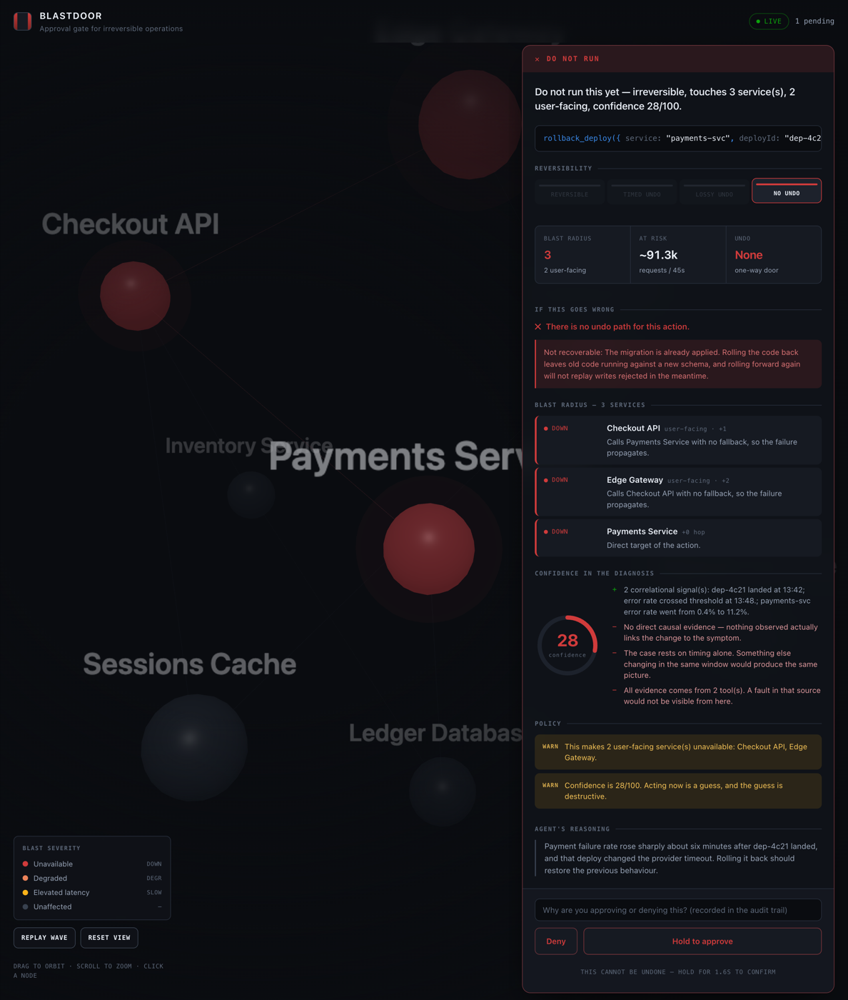
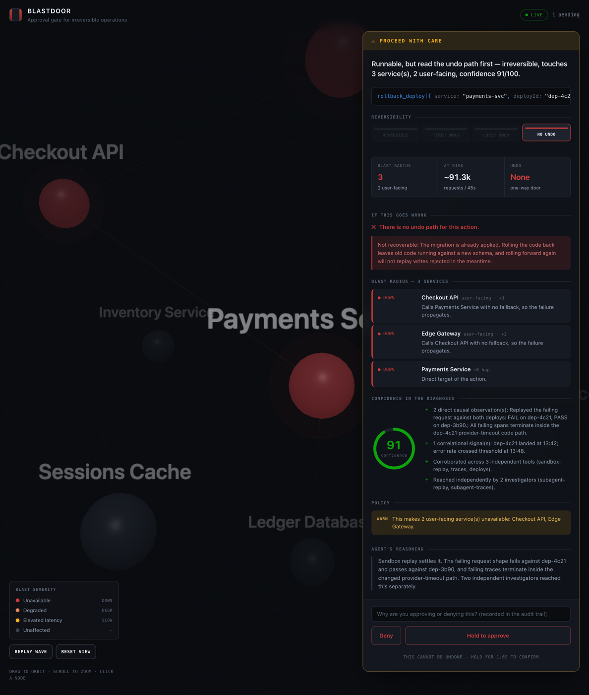

# Blastdoor

**The approval gate that tells you what you are about to break.**

An incident-response agent built on [TrueForge](https://github.com/truefoundry/trueforge). It
investigates production with read-only tools, tests its hypotheses in a sandbox, and then —
before anything irreversible — stops and hands a human a report of exactly what the action
will do, what it will take down, whether it can be undone, and how much the evidence actually
supports the diagnosis.

The agent cannot execute a destructive action. Not "is instructed not to" — *cannot*. The only
path to the production system requires a token a person issues out of band, bound to the exact
arguments they approved.

---

## The problem

Every agent framework has human-in-the-loop approval, and almost all of it looks like this:

```
Agent wants to run: rollback_deploy(service="payments-svc", deployId="dep-4c21")
Allow? [y/N]
```

That prompt teaches the operator nothing they did not already know. They cannot tell from it
whether the rollback is safe, what else it takes down, or whether it can be undone. So they
approve it, because the agent seemed confident and the incident is burning.

Here is what that particular rollback actually does:

> `dep-4c21` applied a schema migration. Rolling the code back leaves old code running against
> a new schema. There is no undo. It takes Checkout API and the Edge Gateway down with it —
> roughly 91,000 requests over the 45-second convergence window. And the evidence is entirely
> correlational: the deploy landed six minutes before the spike, which is also true of the
> other two deploys that afternoon.

None of that is visible in `[y/N]`. Blastdoor's whole thesis is that the pause is only worth
having if the report attached to it is worth reading.

## What it looks like

```
────────────────────────────────────────────────────────────────────────
BLASTDOOR · DO NOT RUN
────────────────────────────────────────────────────────────────────────

Do not run this yet — irreversible, touches 3 service(s), 2 user-facing, confidence 28/100.

ACTION      rollback_deploy(service="payments-svc", deployId="dep-4c21")
EFFECT      Roll payments-svc back from dep-4c21 to dep-3b90. dep-4c21 applied a schema
            migration, so the code moves back but the schema does not.
REVERSIBLE  irreversible

UNDO
  - No undo path exists for this action.
  ! Not recoverable: The migration is already applied. Rolling the code back leaves old
    code running against a new schema, and rolling forward again will not replay writes
    rejected in the meantime.

BLAST RADIUS (3 services)
  DOWN      Checkout API [user-facing]  (+1 hop)
            Calls Payments Service with no fallback, so the failure propagates.
  DOWN      Edge Gateway [user-facing]  (+2 hop)
            Calls Checkout API with no fallback, so the failure propagates.
  DOWN      Payments Service  (+0 hop)
            Direct target of the action.

IN FLIGHT   ~91,350 requests over 45s

CONFIDENCE  28/100
  + 2 correlational signal(s)
  - No direct causal evidence — nothing observed actually links the change to the symptom.
  - The case rests on timing alone. Something else changing in the same window would
    produce the same picture.
```

The same report renders in the web console, where a human approves or denies it.

### The same rollback, twice

These two screenshots are the whole argument. The action is identical in both —
`rollback_deploy(payments-svc, dep-4c21)`. Only the evidence behind it changed.



**Refused at 28/100.** The agent has two correlational signals and nothing else. Blastdoor
says so in the words that matter — *"No direct causal evidence — nothing observed actually
links the change to the symptom"* — and warns that acting now is a guess, and the guess is
destructive. The reversibility ladder shows `NO UNDO` lit with the three safer rungs dark,
so the severity is relative rather than asserted.



**Approved at 91/100.** The agent went and got the evidence: it wrote code in the **sandbox**
that replayed the failing request against both deploys — FAIL on `dep-4c21`, PASS on
`dep-3b90` — and two **subagents** reached the conclusion independently. The blast radius is
unchanged and it is still irreversible, so it still demands a 1.6-second hold. What moved was
the confidence, and it moved because of work, not because the agent tried again more firmly.

Note what did *not* change: the blast radius, the undo path, and the requirement for a human.
Better evidence buys a better-argued request. It never buys the ability to skip the door.

## Run it

Requires **Node 22.18+** (or 23.6+) — the release where Node strips TypeScript types with no
flag, which is how this repo runs with no build step. No Docker, no database, no bundler.

```bash
git clone <this-repo> && cd blastdoor && npm install
```

Check the machine first — Node version, dependencies, and the four ports the stack needs:

```bash
npm run preflight
```

Three processes, three terminals:

```bash
npm run stack      # the production estate           :4000
npm run mcp        # MCP server :4300 + approval broker :4200
npm run console    # the approval console            :4100
```

See the approval cards immediately, without the harness or a model:

```bash
npm run demo
```

Verify the safety property end to end, driving the real MCP protocol. This one acts on the
estate, so it needs `npm run stack` up in another terminal:

```bash
npm run e2e
```

```
  PASS  read-only investigation returns the injected symptom
  PASS  proposal created (prop_17da0871)
  PASS  proposing did NOT execute — the deploy is still live
  PASS  execution without a valid token is refused
  PASS  human approval issued a token
  PASS  a token from another proposal cannot be redeemed
  PASS  approved execution succeeds
  PASS  symptom cleared (checkout-api error rate now 0.4%)
  PASS  an approval token is single use
```

### Wiring it to TrueForge

```bash
npm run harness      # npx @truefoundry/trueforge → http://localhost:8790
```

Add a model provider key in **Settings → Models** — that is the one step that cannot be
scripted, because the key is yours and a provisioning script is the wrong place for a
secret. Then:

```bash
npm run provision
```

```
  OK    MCP server "blastdoor-ops" (created)
  OK    skill "incident-response" (created)
  OK    skill "blast-radius" (created)
  OK    agent "blastdoor-responder" (created)
```

[`scripts/provision.ts`](scripts/provision.ts) registers the connector, mounts both skills
from this repo, and creates the agent with the sandbox, subagents, and approval policy it
is meant to run with. It is idempotent, so re-running after adding the key is safe.
Clicking through Settings does the same thing, but it is not reproducible and you cannot
read it — which is why this is a script.

> **Windows:** TrueForge 0.1.4 does not start on Windows —
> [truefoundry/trueforge#427](https://github.com/truefoundry/trueforge/issues/427). Its
> migration provider `import()`s a raw `C:\…` path and Node's ESM loader rejects it. The
> one-line fix is in [`scripts/patch-trueforge.ts`](scripts/patch-trueforge.ts); apply it with
> `npm run patch:trueforge`, or run the whole stack in the bundled devcontainer instead. The
> local sandbox provider is also macOS/Linux-only, so the sandbox needs either Linux or a
> Daytona key.

Then inject a fault and give it the alert:

```bash
curl -X POST localhost:4000/api/fault/inject \
  -H 'content-type: application/json' \
  -d '{"faultId":"payment-timeout"}'
```

> Investigate the payment-failures alert. Roll back if a deploy caused it.

## How it works

```
                    ┌──────────────────────────────────────┐
                    │            TrueForge                 │
                    │  loop · sandbox · subagents · skills │
                    └───────────────┬──────────────────────┘
                                    │ MCP (HTTP :4300)
                    ┌───────────────▼──────────────────────┐
                    │             ops-mcp                  │
                    │                                      │
                    │  read-only tools ──────────────┐     │
                    │  propose_* ──► blast-radius    │     │
                    │                    engine      │     │
                    │                      │         │     │
                    │                 ┌────▼─────┐   │     │
                    │                 │  broker  │   │     │
                    │                 │ proposals│   │     │
                    │                 └────┬─────┘   │     │
                    └──────────────────────┼─────────┼─────┘
                              HTTP :4200   │         │ HTTP :4000
                    ┌─────────────────────▼──┐   ┌──▼──────────────┐
                    │       console          │   │  target-stack   │
                    │  human reads & decides │   │  the estate     │
                    └────────────────────────┘   └─────────────────┘
```

**`packages/blastdoor-core`** — the engine. Given a proposed action and the state of the
estate, it computes reversibility, walks the dependency graph to find who else is affected,
resolves the undo path, and scores the evidence. No I/O, fully unit tested.

**`packages/ops-mcp`** — the MCP server and the approval broker. Read-only tools pass through
to the estate. `propose_*` tools never execute; they produce a report and a pending proposal.

**`packages/target-stack`** — a deliberately breakable eight-service estate with a
deterministic fault injector, so the demo reproduces exactly every run.

**`packages/console`** — where the human decides. Three files, no framework.

### Three ideas worth pointing at

**Reversibility is a ladder, not a boolean.** Most real operations are reversible only within
a window, or reversible apart from the work in flight when they ran. Collapsing that into
yes/no is how operators get surprised. The interesting case is rollback across a schema
migration — the single most common way a "safe" rollback makes an incident worse — which the
engine reports as genuinely irreversible.

**Impact attenuates.** A naive graph traversal concludes "the entire estate is affected" on
every run, which is true, useless, and trains operators to skim. A caller with a fallback path
absorbs a failure and degrades; a caller without one passes it on. Modelling that is what makes
the blast radius worth reading.

**The approval token is bound to the arguments.** The usual approval pattern is only as strong
as the description the agent wrote — if it can broaden the action between asking and acting,
the human approved something else. Tokens here carry a fingerprint of the approved arguments,
are single use, and expire after fifteen minutes.

## The stack — what each piece does, and why

Nothing here is decorative. For each one: what it does in this project, and what would break
without it.

### TrueForge — the harness

TrueForge is what turns a model into something that can act. Every capability below is on the
critical path; removing any one of them breaks the product rather than degrading it.

| Capability | What it does here | What breaks without it |
|---|---|---|
| **MCP tools** | `ops-mcp` serves **12 tools** — streamable HTTP on `:4300` for the harness, stdio for the e2e suite. TrueForge attaches it as a `remote` connector. | The agent's only route to the estate. There is no back door — remove it and the agent cannot see or touch production at all. |
| **Sandbox** | The agent writes and runs replay/bisect code against `/api/replay` to test a hypothesis, and reports the result as `causal` evidence. | It is how the agent *gets* evidence strong enough to clear the bar for an irreversible action. Metrics alone are correlational and cap confidence well below that bar — the 28 → 91 jump in the screenshots is a sandbox replay, and nothing else moves the number that far. See the note below on what this does and does not enforce. |
| **Human approval** | Every destructive path ends in a proposal. `execute_approved_action` is gated by TrueForge *and* by the broker's token. | The safety property itself. Defence in depth: the harness pauses on the same call the broker would refuse. |
| **Subagents** | Competing hypotheses are delegated and each finding carries an `investigator`. | Corroboration from independent investigators **raises the score**; a lone investigator carrying the whole case is reported as a gap. Delegation that is not attributed earns nothing. |
| **Skills** | Two git-backed skills mounted from this repo (`agent/skills/`). | They carry the reasoning discipline — find the origin, classify evidence honestly, treat a rejection as a list of what to observe next. |
| **Deferred tools** | Read-only tools preload; destructive ones stay deferred. | Investigation starts immediately, and the dangerous surface is not in context until it is actually needed. |
| **Sessions** | The broker holds proposals independently of the agent loop. | An approval outlives a reconnect. A proposal made before a refresh is still waiting after it. |

Provisioning is **code, not clicks** — [`scripts/provision.ts`](scripts/provision.ts) registers
the connector, both skills, and the agent against the harness HTTP API, and is idempotent. A
judge can verify the integration by reading it rather than taking a screenshot's word for it.

> **What the confidence score is, and is not.** Evidence strength is *self-reported*: the
> agent labels each item `causal`, `correlational` or `circumstantial`, and the engine scores
> the labels. It does not verify that a replay actually ran. So the score is an advisory
> reading for the human, not an enforced property — an agent that mislabels its evidence gets
> a higher number than it deserves.
>
> That is a different thing from the safety property, which *is* enforced and *is* tested:
> nothing reaches production without a token a human issued out of band, bound to the exact
> arguments they approved. A wrong confidence score produces a badly-argued request. It never
> produces an execution. Verifying replay provenance end to end is the obvious next step and
> is listed in [`NOTES.md`](NOTES.md).

### Qodo — the code review

Qodo reviewed every pull request in this repo. It was not a rubber stamp: across three PRs and
nine rounds it found **17 real bugs**, every one of which was fixed. Several were things no
test would ever have caught — including a checker that could not run on the very Node version
it existed to diagnose, and a remediation message of mine that would have led an operator into
a broken configuration. Full accounting in
[Qodo Code Review Evidence](#qodo-code-review-evidence) below.

### Everything else, and why it is *not* something bigger

| Choice | Why |
|---|---|
| **Node 22.18+, no build step to run it** | The TypeScript runs directly. A judge clones and runs — no bundler, no `dist/`, no toolchain to install. (The *deployment* does build: [`scripts/build-static.ts`](scripts/build-static.ts) assembles the static console for Vercel. Nothing you run locally needs it.) |
| **No framework in the console** | Three files and the platform. A React build would have added a toolchain to a UI that needs a graph, a panel, and a button. |
| **Three.js** | The blast radius *is* a graph, so it renders as one, and failure travels the dependency edges in hop order. Propagation order is the thing a list throws away. |
| **No database** | The estate and the broker are in-memory and deterministic. The demo reproduces exactly, every run, on any machine. |
| **Vercel** | Hosts the console as a static build so there is a live URL. It cannot run the estate or broker, so it falls back to a **captured** proposal, labelled `demo — no live broker` with a visibly fake token. A safety tool that quietly presented fabricated state as live would be precisely the wrong thing to ship. |

## Testing

```bash
npm test         # 12 unit tests on the engine
npm run e2e      # 9 end-to-end assertions (needs `npm run stack` running)
```

The unit tests cover attenuation through graceful degradation, migration rollback, change
freezes, last-replica restarts, and the treatment of unmodelled tools as irreversible rather
than assumed safe. The e2e suite drives the real MCP protocol and asserts the safety property
directly, including token cross-redemption and replay.

## Qodo Code Review Evidence

[Qodo](https://qodo.ai) reviewed the pull requests in this repo. Both are merged.

To be straight about the history: the first ten commits — the engine, the MCP server and
broker, the console, the TrueForge integration — landed directly on `main` before Qodo was
connected. Everything after that went through a reviewed PR, and the reviews were not a
formality:

| PR | What it carried | Qodo outcome |
|---|---|---|
| [#2](https://github.com/mrayhankhan/blastdoor/pull/2) | `npm run preflight`, and corrections to three wrong facts in this README | **14 findings** over four rounds → final review clean |
| [#1](https://github.com/mrayhankhan/blastdoor/pull/1) | Submission write-up, demo shot list, build retrospective, e2e robustness | **3 findings** over three rounds → final review clean |

Seventeen findings in total, and both PRs finished at **🐞 Bugs (0) · 📘 Rule violations (0)**.
Every finding was real and every one was fixed — none were dismissed as incorrect. (One of the
fourteen restated an issue already fixed in a push the review had not yet picked up.)
The full round-by-round exchange — findings, fixes, and the verification for each — is in
the PR threads.

Three worth reading, because they were caught by review rather than by tests:

**A checker that could never run.** `preflight` exists to tell you your Node is too old to
run this repo's TypeScript — and it was written *in* TypeScript, so on exactly the Node it
was meant to diagnose it died while loading, with the same opaque syntax error it existed
to explain. It is plain `.mjs` now. ([#2](https://github.com/mrayhankhan/blastdoor/pull/2))

**The Windows patch could never bootstrap.** `npm run harness` is
`patch && npx trueforge`. On a machine that had never run it there was no cached bundle, so
the patch exited non-zero, the `&&` short-circuited, and npx never downloaded the thing the
patch needed — while the error told you to run `npm run harness`, the command it had just
killed. A Windows judge would have hit a dead end with no way out.
([#1](https://github.com/mrayhankhan/blastdoor/pull/1))

**My own remediation advice was wrong.** When preflight found an occupied port it said "set
`TARGET_STACK_PORT` to a free port" — but ops-mcp resolves the estate from a separate
`TARGET_STACK_URL` that still pointed at the old one. Following the instruction produced a
passing preflight and a stack that could not reach itself. It now checks that the dependent
variable followed, and prints the exact assignment to make.
([#2](https://github.com/mrayhankhan/blastdoor/pull/2))

Two later rounds caught the *corrections* rather than the original code: comparing whole URL
strings rejected a correctly-wired `http://127.0.0.1:4001`, and fixing that by comparing only
the port then let a wrong path through. Both are in the thread.

## Disclosure

Built during the WeMakeDevs Agent Harness Hackathon, August 2026.

AI assistance was used in building this project, as permitted by the rules — Claude was used
for implementation and review throughout. The architecture, the safety model, and the design
decisions documented above are mine, and I can explain any of them.

The estate in `packages/target-stack` is entirely synthetic. No real production system, no
real telemetry, and no personal data is involved anywhere in this repo.

## Licence

MIT — see [LICENSE](LICENSE).
